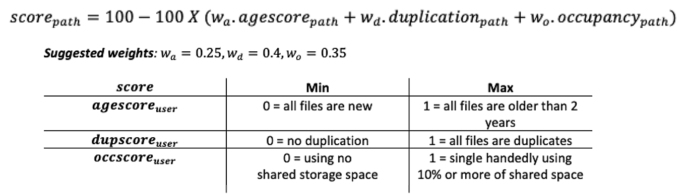

# <code>./spacesaver <b>df</b></code>

## About 
The `./spacesaver` executable is composed of several inter-related sub commands. Please see `./spacesaver -h` for all available options. This part of the documentation describes options, concepts, and output for <code>./spacesaver <b>df</b></code> sub command in more detail. 

<code>./spacesaver <b>df</b></code> can be used to report duplicated disk usage. The output of this command is similar to the unix `df -h` command. Internally this command calls the <code>./spacesaver <b>ls</b></code> command to determine the extent of duplication in a given directory. This command also accepts standard input where the output of ls sub command can be piped into the df command. 

A duplication rate is calculated for each of the provided paths to assess the amount of redudant data in a given location. A weighted score, ranging from 0-100, is also assigned to each provided path where the higher the score, the better!



<code>./spacesaver <b>df</b></code> only has *one required input*, a path or set of paths.

## Synopsis
```text
$ spacesaver df [-h] DIRECTORY [DIRECTORY ...]
```

The synopsis for each command shows its parameters and their usage. Optional parameters are shown in square brackets.

The df sub command takes one or more directories as input. For a given directory, its disk space usage will be reported and assessed. This command can be used to summarize the output from the from the ls sub command into a few easy to interpret metrics. The metrics generated from this command can be used to identify directories which may be candidates for deduplication or for archiving in deeper storage. Please note that symlinks or multiple occurences of hard links will be skipped over as these files do not take up any appreciable disk space. Only one instance of a set of hard links pointing to the same inode will be reported.

Use you can always use the `-h` option for information on a specific command. 

### Required Arguments

Each of the following arguments are required. Failure to provide a required argument will result in a non-zero exit-code.

  `DIRECTORY [DIRECTORY ...]`  
> **Input directories to find duplicates.**  
> *type: path*  
> 
> One or more directories can be provided as positional arguments. From the command-line, each directory should seperated by a space. Globbing is supported! This makes selecting paths easier.
> 
> ***Example:*** `/data/CCBR/rawdata/ccbr123/`

### Optional Arguments

Each of the following arguments are optional and do not need to be provided. 

  `-h, --help`            
> **Display Help.**  
> *type: boolean*
> 
> Shows command's synopsis, help message, and an example command
> 
> ***Example:*** `--help`

## Output 

The output of the df sub command is similar to the unix display free disk space command with more information. Just like the ls sub command, it is displayed to standard ouput.

Here is a description of each column's output:

|          | Column Name        | Example Value                         |
|----------|--------------------|---------------------------------------|
| *1*      | Path               | /data/CCBR/rawdata/ccbr123/           |
| *2*      | Duplicated         | 12.511 KiB                            |
| *3*      | Used               | 1.456 TiB                             |
| ***4***  | ***%Duplicated***  | 0.0%                                  |
| *5*      | wAgeS              | 12.4                                  |
| *6*      | wDupS              | 0.0                                   |
| *7*      | wOccS              | 5.1                                   |
| ***8***  | ***Score***        | 82.5                                  |


***Please note:*** The output is seperated or delimited by tabs: `\t`. *%Duplciated* is reported as the `DuplicatedBytes/TotalBytes`. A *Score* is also assigned to a given path where the higher the score, the better. A *Score* of 0 would indicate that all the files are older than 2.7 years AND all the files are duplicates AND the files make up more than 10% of our shared group area. *wAgeS*, *wDupS*, and *wOccS* are the weighted indiviudal components that make up the *Score* listed in column 8.

## Example

Please note this sub command may take a while to process depending on the shear number or the size of files existing in a given sub tree. As so, this command should not be run on the head node! Please allocate an interactive node prior to running this command or submit this command as a job via sbatch.

```bash 
# Step 0.) Grab an interactive node
# Do not run this on the head node!
srun -N 1 -n 1 --time=12:00:00 -p interactive --mem=16gb  --cpus-per-task=4 --pty bash
module purge

# Option 1.) Repprt disk space usage of a directory
./spacesaver df /data/CCBR/rawdata/ccbr123/

# Option 2.) Read ls sub command from standard input
./spacesaver ls /data/CCBR/rawdata/ccbr123/ > ccbr123_ls.tsv
./cat ccbr123_ls.tsv | spacesaver df /data/CCBR/rawdata/ccbr123/
```